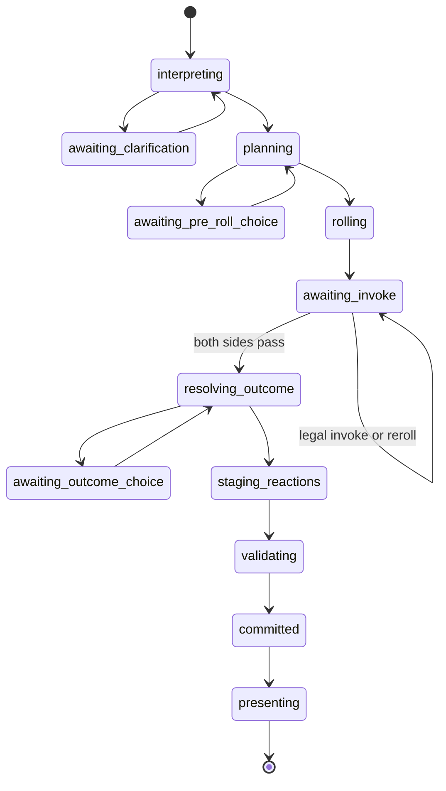

# Implementation specification: conversation RPG with Fate Condensed

Status: ready for implementation · 4 October 2026 · Target: playable v0.1

## 1. Purpose and precedence

Implement the game described in [World representation and turn resolution](world-architecture.md), using the Fate Condensed profile specified here. This document supplies the implementation decisions, interfaces, rules boundaries, fixture adventure, and acceptance criteria that the architecture left open.

Follow this document for concrete implementation choices. The architecture remains the source of design intent. In particular, its `conversation-d20`, persuasion bonus, DC 12, d20 roll, and fixed gate-success examples are illustrative and **must be replaced by the Fate rules below**. Keep its separation of intent, proposal, authoritative state, events, beliefs, and narration.

Build a working game, including one real model adapter and a complete offline demonstration. Do not stop at schemas, a mocked CLI, or an engine that only prints model prose. Models propose interpretations and character behavior; validated events are the only route to changing the world.

Use the labels **Fate rule**, **v0.1 policy**, and **authored content** consistently in implementation comments and rules data. A v0.1 policy is a deliberate restriction or adaptation for this computer game, not a claim about unmodified Fate.

### Required scope

- One local campaign, one human-controlled character, multiple NPCs, and free-form English input.
- Conversation, exploration, inventory and transfers, offers, beliefs, secrets, quests, and scheduled effects.
- Fate dice, four actions, aspects, free invokes, Fate points, three authored stunts, stress, consequences, concession, and a small conflict loop.
- Durable choices during resolution, including post-roll invokes. Reloading must resume the exact pending choice.
- A playable authored adventure with success and failure endings; a live model route and deterministic scripted fixtures.
- SQLite save/load, JSON export/import, offline replay, diagnostics, and meaningful automated tests.

Defer multiplayer, procedural campaigns, character creation UI, advancement choices, spell systems, ranged combat, general contests/challenges, vector retrieval, autonomous agent frameworks, and a live Jev integration. Preserve extension points, but none of these is a prerequisite for v0.1. The four action handlers and minimal conflicts are required, even though the main adventure can be completed peacefully.

## 2. Stack and repository layout

Use **Python 3.12**, `uv` for dependency management, Pydantic 2 for typed boundaries, Typer for CLI subcommands, Rich for optional terminal formatting, and the standard-library `sqlite3` module. Use the official `openai` Python SDK for the first live adapter. Test with `pytest` and Hypothesis; use Ruff and mypy for code checks. Pin resolved dependency versions in `uv.lock` when implementing; do not copy speculative version numbers from this document.

Pydantic models can produce JSON Schema; export schemas from these models instead of maintaining separate hand-written copies. Pydantic remains an input boundary, not a replacement for game validation. See [Pydantic JSON Schema](https://docs.pydantic.dev/latest/concepts/json_schema/). Use explicit transaction management with `sqlite3`, documented in the [Python SQLite reference](https://docs.python.org/3/library/sqlite3.html).

Use synchronous orchestration initially. Provider calls may block the input loop, but show a progress indicator and support interruption. Never hold a database write transaction during a network call or while awaiting the player.

```text
pyproject.toml
uv.lock
README.md
.env.example
docs/
  world-architecture.md
  implementation-plan.md
src/world_game/
  cli.py                    # Commands, REPL, terminal rendering
  config.py                 # Validated settings and provider construction
  domain/
    state.py                # World and component models
    fate.py                 # Aspects, sheets, rolls, conflicts
    intents.py              # Intent and player-choice contracts
    events.py               # Discriminated event union and batch envelope
    proposals.py            # Model-facing contracts
  engine/
    queries.py              # Pure queries and perspective projections
    validation.py           # Referential, causal, permission checks
    reducer.py              # Pure event/batch application
    fate_rules.py           # Dice arithmetic and outcome tables
    actions.py              # Registered action/effect handlers
    turns.py                # Durable resolution state machine
    scenes.py               # Scene/session boundaries and NPC action order
    scheduler.py            # Tick-based scheduled handlers
    randomness.py           # Serialized deterministic dice source
  story/
    schema.py               # Story package and validated expression types
    loader.py               # References, hashes, package validation
  models/
    interfaces.py
    scripted.py
    openai_provider.py
    prompts/                # Versioned role instructions, packaged resources
  persistence/
    repository.py
    sqlite.py
    migrations/
  data/stories/gate_at_dusk/
    manifest.json
    entities.json
    profiles.json
    rules.json
    aspects.json
    quests.json
    scenes.json
    dialogue.json
    fixtures/
tests/
  unit/
  integration/
  fixtures/
  evals/                    # Opt-in live-model evaluation cases
licenses/
  fate-condensed-NOTICE.txt
  CC-BY-3.0.txt
```

Package the story and prompts as resources available after installation; do not depend on the current working directory. Establish a `world-game` entry point. Keep `domain` and deterministic `engine` modules independent of SDKs, terminal rendering, and SQL.

## 3. The v0.1 Fate profile

Ruleset ID: `fate-condensed-cli-v1`. Pin its data hash in each campaign. The following is an implementation profile rather than a reproduction of the rulebook. Consult the linked primary rules for explanations; implement the finite behavior specified here.

### 3.1 Character sheet and nine skills

**Authored content:** use these skill IDs and purposes. The allowed uses below are bounds on interpretation; a character still needs an appropriate fictional opportunity.

| ID | Purpose | Common action permissions |
| --- | --- | --- |
| `athletics` | Movement, strength, endurance; merges Athletics and Physique | Overcome physical obstacles; create physical advantages; defend physical attacks |
| `fight` | Unarmed and melee combat | Attack; defend melee; create combat advantages |
| `notice` | Immediate perception and reading visible behavior | Overcome detection tasks; discover advantages; oppose concealment/deception when perceptible |
| `investigate` | Deliberate inquiry, research, setting knowledge | Overcome mysteries; discover advantages |
| `influence` | Honest persuasion, negotiation, and overt social pressure | Overcome; create advantages; mental attack only in an established harmful confrontation |
| `deceive` | Lies, disguises, misdirection | Overcome; create advantages |
| `stealth` | Concealment and unnoticed movement | Overcome; create advantages |
| `craft` | Mechanisms, tools, repairs, practical treatment | Overcome; create advantages |
| `will` | Mental resistance and composure | Overcome internal obstacles; defend mental attacks or coercion |

Assign the PC ratings `[4, 3, 3, 2, 2, 2, 1, 1, 0]`, one per skill. This is our authored allocation for a shortened list. Skill values are integers; the initial profile permits 0–4. All nine must exist on PC sheets. Unlisted skills on minor NPC sheets evaluate to 0. A skill does not grant equipment, access, or supernatural ability.

The PC has five character aspects: concept, trouble, relationship, and two additional traits; refresh 3; initially 3 Fate points; and exactly the three stunts below. Extra purchased stunts and advancement are deferred. Fate explicitly permits alternative skill lists and describes character aspects, refresh, and stunts in [Getting started](https://fate-srd.com/fate-condensed/getting-started).

### 3.2 Three authored stunts

All are passive +2 modifiers with engine-checkable conditions. They have no Fate-point cost, do not stack with themselves, and apply only once to an eligible roll. Their IDs and predicate arguments live in story data.

| ID | Name | Eligible roll and condition |
| --- | --- | --- |
| `official_bearing` | Official Bearing | `deceive/overcome` to gain authorized-looking access, while visibly presenting a possessed item tagged `credential` to the access controller |
| `read_the_room` | Read the Room | `notice/create_advantage` to discover a target's concern during a direct conversation the actor participates in |
| `quick_hands` | Quick Hands | `craft/overcome` to open a `mechanical_lock`, with a possessed item tagged `lockpick` |

A model may propose the action's purpose, but it cannot award a stunt bonus. Code checks the resolved handler, goal, current conversation, target, item placement, and authored tags. Do not allow model-generated stunts or executable predicates in v0.1.

### 3.3 Dice, opposition, and outcomes

**Fate rule:** a roll uses four independent dice with equally likely values -1, 0, +1. Effort is their sum plus the skill and legal modifiers. Compare effort with static difficulty or a defender's effort. Margins below 0 fail; 0 ties; 1–2 succeed; 3 or more succeed with style. See [Taking action](https://fate-srd.com/fate-condensed/taking-action-rolling-dice).

**v0.1 policy:** each authored handler chooses static or active opposition before any dice are drawn. Direct attacks and advantages imposed on another character require a legal defense roll. Authored access checks may use static difficulty. Use difficulty 0, 2, or 4 for ad hoc easy, ordinary, or hard obstacles; use 6 only for an explicitly authored exceptional task. Impossible actions remain impossible rather than acquiring a high difficulty.

Store a finalized `ResolutionPlan` before rolling: action, skill, opposition, eligible stunts, time cost, allowed consequences, and rule ID. The player sees the goal, skill, observable stakes, and applicable known aspects. Once dice are drawn, model retries cannot revise that plan or consume fresh dice.

Implement these result branches. The compact action matrix follows [Fate's four actions](https://fate-srd.com/fate-core/four-actions); the separate unknown-aspect branch follows the Condensed rules below.

| Action | Failure | Tie | Success | Success with style |
| --- | --- | --- | --- | --- |
| Overcome | Failure or authored major-cost success | Minor-cost success | Goal achieved | Goal achieved and a boost |
| Create new advantage | No aspect, or aspect with enemy free invoke | Boost only | Aspect plus one free invoke | Aspect plus two free invokes |
| Enhance known aspect | Enemy free invoke | One free invoke | One free invoke | Two free invokes |
| Attack | No hit | Attacker boost | Hit equal to margin | Hit equal to margin; optionally trade one shift for a boost |
| Defend | Opposing action succeeds | Opposing action's tie branch | Opposing action stopped | Opposing action stopped and defender boost |

For discovering an **existing unknown aspect**: failure lets its controller reveal it for an enemy free invoke or leave it secret; tie gives the discoverer a boost without revealing it; success reveals it and grants one free invoke; style grants two. This differs from enhancing a known aspect. See [Condensed advantage outcomes](https://fate-srd.com/fate-condensed/taking-action-rolling-dice#actions).

Resolve one opposed pair once. The attacker's tie boost and defender's tie interpretation are the same outcome, not two grants. A defender's style boost is available when its margin is at least 3; the attacker still receives only its own failure branch. A boost requested by an outcome must have a valid authored/templated description; use a neutral `momentary_opening` template if generation fails.

Each handler supplies concrete failure/minor-cost/major-cost effects. No outcome may be an empty instruction such as “something bad happens.” The UI asks before an optional major-cost success or damage-for-boost trade. If the player declines major-cost success, apply the already defined failure result. Ordinary informational speech requires no roll.

### 3.4 Aspects, boosts, and invoking

**Fate rule:** aspects establish facts about the fiction; boosts are short-lived opportunities with one free use. A paid invoke generally supplies +2 or replaces a four-die roll. A single aspect cannot be paid-invoked repeatedly on one roll, but its free invokes can stack. See [Aspects and Fate points](https://fate-srd.com/fate-condensed/aspects-and-fate-points) and [Invoking aspects](https://fate-srd.com/fate-core/invoking-compelling-aspects).

**Implementation decisions:**

- Keep aspect text plus a typed `grounding` reference. A belief aspect can say `Oren believes Lea is expected`; it must not turn the expectation itself into truth. Generated aspect creation is limited to registered templates.
- Grounding supplies permissions through named predicates. Text alone cannot grant immunity, ownership, or new skills. Evaluate semantic relevance through a bounded relevance decision, then check scope, knowledge, availability, and budget in code.
- Store free-invoke counts by controller ID. Control determines who may spend them; aspect subject determines hostile-invoke payouts. These are different roles.
- Model boosts as `kind=boost`, one free invoke, no paid invokes or compels. Delete a spent boost. Expire unused boosts when their opportunity ends or the scene closes.
- A paid invoke consumes one point. A free invoke consumes one controlled use. A reroll replaces only that side's dice, retaining skill/stunt bonuses and other +2 modifiers. It is an intentional new random draw, distinct from a network retry.
- Track `paid_aspect_ids_used` separately for each side of each check. Permit one paid use plus any available free uses of an aspect. Reject overspending, reused choice IDs, and attempts to invoke unknown/expired aspects.
- Offer relevant invokes after initial rolls and before the result becomes final. `/pass` accepts the current result. Additional valid invokes reopen the response opportunity until both sides pass consecutively.
- For v0.1 NPCs, use a deterministic spend policy: take a relevant +2 only when it improves the outcome category, choose free uses before paid uses, then aspect ID order. Do not use NPC rerolls in v0.1. Enforce the scene's shared GM pool.
- A paid hostile invoke against another character's aspect queues one point for its subject after the scene; free invokes pay nothing. PC awards go to their balance; NPC awards become that NPC's carryover credit for its next participating scene.
- Scene expiration removes temporary mechanical opportunities, not persistent world facts. A fire aspect backed by a burning object lasts until that grounding becomes false, even across scene boundaries.

The response procedure and deterministic NPC strategy are computer-game policies. For this profile, NPC/GM spending occurs only on active opposed rolls; static checks retain their fixed difficulty and have no GM invoke window. Display what each invoke changes; never ask a model to spend the player's points. For a failed attempt to discover an unknown NPC aspect, the default NPC policy preserves the secret instead of revealing it for a free invoke.

### 3.5 Compels and Fate-point economy

**Fate rule:** accepted compels award a point and introduce a complication; refusing an appropriate compel costs a point. An inappropriate compel can be withdrawn without charge. Keep paid invokes and compels distinct. See [Compelling aspects](https://fate-srd.com/fate-core/invoking-compelling-aspects).

**v0.1 policy:** implement authored **event compels** only, offered at a turn boundary with a visible complication and `accept`, `refuse`, or `object` choices. With zero points, refusal is unavailable; `object` is still available for a mismatch. In this prototype, objection withdraws the proposed compel and records the objection for evaluation. Limit each compel template to once per authored trigger. Do not generate decision compels that dictate PC speech or actions.

Accepting or refusing commits a zero-tick event batch. The offer itself is a durable pending interaction; no point moves until the choice commits. A GM compel draws from the unlimited compel supply, not the scene's invoke pool. Player-initiated compels against NPCs are deferred and must be identified as unsupported, without consuming points.

At authored session start, the PC balance becomes `max(current, refresh)`. Session starts are story transitions, never application starts. At scene start, initialize the GM pool to the number of participating PCs plus eligible NPC carryover credits, consuming those credits once. Unspent base pool does not carry forward. These source mechanics are described in [Refresh](https://fate-srd.com/fate-condensed/getting-started#refresh) and [GM Fate points](https://fate-srd.com/fate-condensed/being-game-master#your-fate-points).

### 3.6 Stress, consequences, and small conflicts

Use separate physical and mental stress tracks. **v0.1 adaptation:** Athletics replaces Physique for physical capacity; Will determines mental capacity. Capacity is 3 at rating 0, 4 at 1–2, and 6 at 3–4. Track marked boxes as a count because all boxes absorb one shift. Provide consequence slots absorbing 2, 4, and 6 shifts, each usable once until recovered. These capacities follow the Condensed sheet structure, with our explicit skill substitution. See [Stress and consequences](https://fate-srd.com/fate-condensed/getting-started#stress-and-consequences).

On a hit, the defender chooses available stress and consequence slots whose absorption covers the hit. Excess absorption is allowed; partial absorption followed by silently ignoring remaining damage is not. Newly created consequences grant the attacker a free invoke. If the defender cannot or will not cover the hit, apply the authored taken-out result. Stress clears at scene end. The shared absorption/consequence principles are explained in [Resolving attacks](https://fate-srd.com/fate-core/resolving-attacks); use Condensed's one-point boxes, not Core's escalating boxes. Concession is available before the next opposed roll, yields a negotiated loss, and awards one point plus one per consequence acquired in that conflict, payable at conflict end. See [Conceding](https://fate-srd.com/fate-core/conceding-conflict).

For the PC, display legal absorption combinations as numbered choices; consequences use a finite authored catalog such as `bruised`, `sprained_wrist`, `shaken`, and `rattled_confidence`, with severity and harm type. NPCs choose the legal allocation with lowest consequence severity sum, then fewest stress boxes, then stable slot order. The demo's defeat policy is capture, never an invented death or forced change of beliefs.

Use 2–4 zones represented by location entities and portals. A conflict stores participants, side IDs, active actor, exchange number, and acted IDs. Each actor takes one proactive action per exchange; defenses are reactions. After acting, select an eligible next actor. For the player, prompt only if more than one is eligible; NPCs select by sorted ID. The final actor chooses the next exchange's first actor. Initial actor comes from the scene trigger. Allow one unimpeded adjacent move alongside an action; impeded movement is an overcome action. This ordering follows [Condensed turn order](https://fate-srd.com/fate-condensed/challenges-conflicts-and-contests#turn-order), with deterministic NPC selection supplied here.

Persist each completed proactive conflict action as its own batch; never roll back earlier actions because a later action or model call fails. The original architecture's “whole turn” is therefore an action plus its defenses and immediate effects, not an entire multi-actor exchange. Increment the player turn counter only for completed PC proactive actions; world version increments for every committed batch. Advance one world tick per completed conflict exchange, and one tick per ordinary consequential action outside conflict. Ending a conflict mid-exchange charges that final partial exchange once; store the last charged exchange to prevent double charging.

Before an NPC attack rolls, show its observable intent and a `continue`/`concede` opportunity. Concession terms are story templates, not a model's unrestricted surrender terms. End a conflict once one side has no active participant. Mental conflict requires an authored harmful objective; ordinary persuasion never automatically inflicts mental damage.

Consequence recovery must remain explicit. Treatment uses `craft` for physical harm and `influence` for mental harm, against 2/4/6 for mild/moderate/severe, plus 2 for self-treatment. After successful treatment, mild recovery waits through one complete subsequent scene, moderate through one complete subsequent session, and severe until an authored breakthrough. Store boundary sequence numbers; restarting cannot heal anything. Use the [Condensed recovery rules](https://fate-srd.com/fate-condensed/challenges-conflicts-and-contests#recovering-from-conflicts) with those authored treatment-skill mappings. Advancement choices are deferred, but an authored `BreakthroughReached` handler can finish recovery.

## 4. Domain contracts

### 4.1 Serialization conventions

Use Pydantic boundary models with `extra="forbid"`, strict scalar validation, explicit enums, bounded lists/strings, and discriminated unions. Test strict JSON deserialization separately from Python-object validation. Optional fields must have defined semantics; providers may require nullable fields to be present. Store all amounts, ratings, ticks, and counters as integers. Provider confidence floats belong only in diagnostic/decision records.

Entity IDs are stable strings, for example `actor:lea`. Persisted generated IDs are assigned by the engine using a campaign prefix and monotonic counter; models use temporary proposal labels until accepted. Canonical JSON is UTF-8 with sorted object keys, compact separators, no NaN, and no insignificant whitespace. Sort semantic sets before encoding. Use SHA-256 for package and state hashes. Hash only canonical game state, not timestamps, narration, or model logs.

Use immutable-by-convention domain values: reducers return a new state. Derived inventory, visible exits, and legal-choice lists must not become independently mutable records.

### 4.2 Required records

Implement the following contracts; field names are normative. `Map<ID,T>` means a JSON object keyed by ID. References must resolve after package load and after every batch.

| Record | Required data |
| --- | --- |
| `WorldState` | `schema_version`, `campaign_id`, `world_version`, `ruleset_ref`, `story_ref`, `clock`, `rng`, `next_id`, `entities`, `propositions`, `beliefs`, `knowledge`, `relationships`, `aspects`, `conversations`, `offers`, `commitments`, `quests`, `scheduled_effects`, `scene`, `session`, `conflict` |
| `clock` | `player_turn`, `tick`; both nonnegative integers |
| `Entity` | `id`, `kind`, `identity`, optional typed `placement`, `location`, `portal`, `item`, `actor`, `fate`; a kind/component compatibility validator |
| `identity` | `name`, `aliases`, `description`; aliases are language hints, not IDs |
| `placement` | `container_id`; at most one physical parent, no cycles |
| `portal` | exactly two location `endpoints`, `open`, `locked`, `key_item_ids`, `tags` |
| `item` | `tags`, `quantity`; unique demo items have quantity 1 |
| `actor` | `profile_ref`, `goal_ids`, `status` (`active`, `conceded`, `taken_out`), `disposition` |
| `FateSheet` | `skills`, `stunt_ids`, `refresh`, `fate_points`, `physical_stress_used`, `mental_stress_used`, `consequence_slots`; NPC paid invokes use GM pool instead of personal points |
| `Proposition` | `id`, typed `predicate`, entity/value `arguments`, `truth` (`true`, `false`, `unknown`), `source`, `discovery_policy_id` |
| `Belief` | `id`, `holder_id`, `proposition_id`, `stance`, `source_event_ids`, `acquired_tick`; authored initial beliefs use a `story_ref` source |
| `KnowledgeState` | Per actor: `known_entity_ids`, `known_record_ids`, `observations`; each observation records a typed perceived value, source event, and acquisition tick |
| `Relationship` | `id`, `from_id`, `to_id`, registered `kind`, typed `value`, `source`; trust values bounded -2..2 |
| `Aspect` | `id`, `text`, `kind`, `subject_id`, `scope`, `grounding`, `known_by`, `free_invokes`, `lifetime`, `source`; fields detailed below |
| `Conversation` | `id`, `participant_ids`, `location_id`, `topic`, `recent_utterance_ids`, `unresolved_question`, `offer_ids` |
| `Offer` | `id`, `proposer_id`, `recipient_id`, registered `terms`, `status`, `expires_tick`, `source_event_id`; terms contain typed transfer and commitment records |
| `Commitment` | `id`, `debtor_id`, `creditor_id`, typed `fulfillment_predicate`, `breach_trigger_id`, `status` (`active`, `fulfilled`, `broken`), `source_event_id` |
| `Quest` | `id`, `definition_ref`, `stage`, `completed_objective_ids`, `terminal_result` |
| `ScheduledEffect` | `id`, `due_tick`, `priority`, `handler_id`, typed `args`, `status`; process by `(due_tick, priority, id)` |
| `SceneState` | `id`, `definition_ref`, `sequence`, `participant_ids`, `gm_fate_pool`, `deferred_awards`, `started_tick` |
| `SessionState` | `id`, `sequence`, `completed_scene_ids`, `applied_boundary_ids`; include NPC carryover credits in campaign state under this record |
| `ConflictState` | nullable; `id`, `scene_id`, `participants`, `active_actor_id`, `exchange`, `acted_ids`, `consequences_taken`, `pending_concession_awards` |

Use named nested models, not `dict[str, Any]`, for predicate arguments, offer terms, conditions, or effects. For extension points, add a new registered union variant and schema version. Unknown handler IDs are package errors.

Consequence slots store an aspect ID or null; the aspect owns its severity, treatment, and recovery data. NPC sheets have an explicit authored stress-capacity override, allowing the demo's minor NPCs to have three boxes irrespective of skill; PC capacities are derived. NPC `fate_points` remains zero and is not a second spendable pool.

Seed initial perceptions in version 0. At each committed change, record new passive observations for characters who can perceive it; scene entry includes visible names and objects. `/look` displays that projection without generating new discoveries. Active searches use action handlers. Stored observations describe what was seen then, not a guarantee that a remote fact is still true; NPC contexts label stale observations accordingly.

### 4.3 Aspect representation

Example of a persisted situation aspect after a successful deception advantage; this is a record example, not a complete save:

```json
{
  "id": "aspect:demo:17",
  "text": "Oren believes Lea is an expected courier",
  "kind": "situation",
  "subject_id": "actor:oren",
  "scope": {"kind": "conversation", "id": "conversation:gate"},
  "grounding": {"kind": "belief", "id": "belief:demo:16"},
  "known_by": ["actor:lea", "actor:oren"],
  "free_invokes": {"actor:lea": 1},
  "lifetime": {"kind": "until_grounding_false"},
  "source": {"kind": "event", "id": "event:demo:8:5"}
}
```

The grounding union supports `authored_trait`, `component_predicate`, `proposition`, `relationship`, and `belief`. Only the first can establish a non-derived trait at character/package creation; the others refer to underlying state. `scope` can be character, location, conversation, or scene. `lifetime` can be persistent, scene-bound, next-eligible-use, or until-grounding-false. A consequence aspect also names its slot, harm type, treatment status, and recovery boundary.

`known_by` means awareness of the relevant fictional circumstance, not automatic possession of everyone else's private interpretation. Projection can describe Oren's own aspect as `You believe Lea is expected`; it must not tell him he has been deceived. If a belief changes, invalidate dependent aspects and unused invokes in the same batch. Mechanical expiry never silently reverses its supporting component fact.

### 4.4 Queries and pure engine interfaces

Provide these interfaces, with typed return models:

```python
def validate_story(package: StoryPackage) -> list[ValidationIssue]: ...
def project(state: WorldState, viewer: Viewer, purpose: ContextPurpose) -> ContextView: ...
def resolve_references(text: str, view: ContextView) -> ReferenceCandidates: ...
def plan_action(state: WorldState, intent: Intent, ruling: Ruling) -> ResolutionPlan: ...
def classify_margin(effort: int, opposition: int) -> Outcome: ...
def legal_choices(state: WorldState, pending: PendingResolution) -> list[Choice]: ...
def validate_batch(state: WorldState, batch: EventBatch) -> list[ValidationIssue]: ...
def apply_batch(state: WorldState, batch: EventBatch) -> WorldState: ...
```

Models are called by the coordinator to obtain typed intent/ruling data; these functions never call a provider. `apply_batch` performs no random generation, I/O, clock access, or prompt processing.

## 5. Events, randomness, and persistence

### 5.1 Event contract

Use an envelope with `batch_id`, `input_id`, `base_world_version`, `result_world_version`, `player_turn_after`, `events`, `state_hash_after`, and `schema_version`. `result_world_version` equals base plus one. A committed batch is immutable.

Each event has `id`, `sequence`, `type`, `schema_version`, typed `payload`, `actor_id` (nullable for the scheduler), `rule_id`, `cause_ids`, `observed_by`, and `tick`. The engine assigns metadata. Causes may reference earlier events in the batch or committed history, never future events. Model result IDs are separate evidence references and cannot impersonate causal game events.

Implement event families with separate typed variants:

| Family | Minimum variants and payload requirements |
| --- | --- |
| Physical state | `EntityMoved(entity, from, to)`, `ItemTransferred(item, from, to)`, `PortalChanged(portal, before, after)` |
| Conversation | `UtteranceMade(speaker, text, audience, claims, disclosures)`, `ItemPresented(actor, item, audience)`, `ObservationRecorded(holder, record)`, `BeliefChanged(before, after)`, `RelationshipChanged(before, after)` |
| Offers | `OfferMade(record)`, `OfferResolved(id, before_status, after_status)`, `CommitmentMade(record)`, `CommitmentResolved(id, before_status, after_status)`; transfers/promises must be separate causal events in the same batch |
| Fate | `CheckResolved(record)`, `AspectCreated(record)`, `AspectChanged(before, after)`, `AspectRemoved(id, reason)`, `FatePointsChanged(account, before, after, reason)`, `StressChanged(actor, track, before, after)`, `ConsequenceChanged(actor, slot, before, after)` |
| Story | `QuestTransitioned(id, from, to)`, `EntityCreated(template, record)`, `PropositionEstablished(record)`, `ScheduledEffectResolved(id, outcome)` |
| Lifecycle | `TimeAdvanced(from, to)`, `SceneEnded`, `SceneStarted`, `SessionStarted`, `ConflictStarted`, `ConflictAdvanced`, `ConflictEnded`, `ActorStatusChanged`, `BreakthroughReached` |

Expand lifecycle payloads to contain every changed value and the authored transition ID. Scene-ending effects must include pool payouts, expiry, and recovery as explicit events. No event performs an invisible side effect that replay cannot reproduce. `CheckResolved` includes plan, both sides' dice, modifiers, invoked aspect uses, margin, result, and RNG continuation. Fate-point/free-invoke consumption is represented explicitly; replaying `CheckResolved` must not charge them again.

`PropositionEstablished` may fill an unknown slot or add an allowed generated fact. It cannot overwrite an established truth; actual changes in the world require a corresponding typed domain handler. Runtime models cannot create new predicates.

### 5.2 Randomness contract

Use a versioned deterministic dice source behind `DiceSource`. To avoid persisting opaque language-runtime RNG objects, implement `sha256-counter-v1` for this prototype:

1. Generate a 32-byte seed from the OS when creating a campaign; store its lowercase hex encoding and a counter starting at 0.
2. For each sample, hash `b"world-game/dice/v1" + bytes([0]) + seed_bytes + counter.to_bytes(8, "big")`, then increment the counter. Interpret the first 8 digest bytes as an unsigned big-endian integer `n`.
3. For a die with `faces`, use rejection sampling: accept only `n < 2**64 - (2**64 % faces)`; return `n % faces`. Rejections consume counters too. Fate dice use 3 faces mapped to -1, 0, +1.
4. Four accepted samples form a Fate roll. Record each draw's stable `check_id`, side, reroll index, faces, seed reference, and before/after counter.

Reference vector: with 32 zero seed bytes and counter 0, the first eight Fate faces are `[-1, 0, 1, 0, 0, -1, 0, 1]`; the resulting counter is 8. Raise an explicit error if the 64-bit counter is exhausted.

This is a reproducible game random stream, not a secrecy or anti-cheat system. Tests also inject explicit dice sequences. Store staged draws and the continuation in the pending-resolution record before displaying rolls or making dependent calls. Restore recorded draws on resume. A retry consumes zero draws; an explicitly purchased reroll consumes four accepted samples.

Commit RNG continuation with the event batch. Replay restores continuation from recorded results; it does not roll again. Never let a player abandon an already revealed roll and retry that same action as a fresh input. Closing the CLI simply preserves it.

### 5.3 Database and recovery

Use one database per campaign under a configurable save directory, defaulting to `~/.local/share/world-game/campaigns/`. Enable foreign keys and use explicit `BEGIN IMMEDIATE`/`COMMIT` for short mutation transactions. Persist these tables:

| Table | Key/constraints | Contents |
| --- | --- | --- |
| `campaign` | one row; campaign ID | Current version/hash, pinned schemas/reducer, package hash |
| `story_package` | content hash | Exact original JSON resources and normalized definitions |
| `snapshot` | unique world version | Full canonical state JSON and hash; include version 0 |
| `event_batch` | unique batch ID, input ID, result version | Envelope and resulting hash |
| `event` | unique `(batch_id, sequence)` and event ID | Event JSON |
| `interaction` | ID; at most one active per campaign | Status, base version, pending resolution, choice revision, raw input |
| `choice_response` | unique response ID; unique accepted `(interaction_id, choice_revision)` | Selected option, resulting pending revision |
| `model_call` | stable call key | Role/context/prompt hash, model, status, structured response, timing/usage |
| `presentation` | unique batch ID | Fallback outcome, optional narration, delivery status |

In one commit transaction: verify base version; append batch/events; insert resulting snapshot; advance campaign version/hash; mark interaction committed; persist a factual fallback outcome. If `input_id` already committed, return its saved result. Roll back the entire transaction on any failure. Do not update the in-memory authoritative world until commit succeeds.

Pending-state updates use `choice_revision` compare-and-swap independently of world version. This prevents duplicated `/choose` responses from consuming a second point. New game actions are rejected while a pending interaction is active; read-only commands and quit remain available.

On load, verify package/version support and latest snapshot hash. A recovery command can rebuild into a new database from initial state and committed batches; it must compare every recorded resulting hash. Never quietly replace a corrupted source save. Retain source schemas/reducer versions; v0.1 can reject newer versions with an actionable message. Add migrations only alongside an actual schema change.

JSON export includes the package, snapshot, committed batches, pending interaction and its choices/draws, and saved presentations. Import validates everything, creates a new local database, and resumes pending choices unchanged. Provider credentials and authorization headers are excluded. Gameplay equivalence across export/import includes random continuation and pending resources, not log timestamps. Debug logs are optional exports.

## 6. Durable resolution and player choice

### 6.1 Pending resolution

`PendingResolution` is operational state, persisted alongside the last committed world:

```text
interaction_id, input_id, base_world_version, choice_revision
phase, actor_id, raw_input, interpreted_intent
resolution_plan, staged_events, staged_rng, recorded_rolls
invoke_ledger, provisional_resource_balances, completed_model_call_keys
current_choice, completed_choices, resume_phase
```

`current_choice` has `choice_id`, `kind`, player-visible `prompt`, finite `options`, and a state/context hash. Each option has a stable ID, label, and a typed engine command. Only the ID is accepted from the CLI; clients/models cannot replace its command payload. Types include clarification, invoke, cost, harm allocation, concession, compel, and next actor.

Store enough data to reconstruct the working state as `apply_staged_events(base_state)`. Treat a cached working snapshot as disposable. A resumed choice must use staged point balances and free invokes, not the old committed balances. Bound every event/effect list; default maximum 100 events per batch and 20 scheduled triggers per action.

### 6.2 State machine



No-roll actions skip rolling and invokes. A compel interaction goes directly from its prepared offer to its choice, validation, and zero-tick commit. Technical failures enter a resumable `failed` state with `resume_phase`; they do not create a game outcome. Invalid input leaves the same choice pending. Persist phase changes before presenting their associated prompts.

Coordinator algorithm:

1. Check for a committed input or active pending interaction; return/resume it before interpreting new action text.
2. Build the PC's projection; interpret one next action. Preserve remaining compound intentions as text hints only. Require new input before a second consequential action.
3. Bind the intent to a registered handler and validate targets, permissions, and required objects. For ambiguity, issue a durable clarification. For an impossible attempt, explain the observable blocker without spending time or revealing hidden reasons.
4. Create and persist the plan. Use authored rules directly when matched. Ask the adjudicator only when a custom attempt needs a choice among legal templates or difficulty levels.
5. Resolve pre-roll choices, including concession. Draw, persist, and show dice. Run the invoke response procedure. Each player choice and NPC response updates the same pending record atomically.
6. Resolve the outcome table and optional cost/harm choices. Stage resource, physical, belief, aspect, and story events using the finalized mechanics.
7. Obtain at most one immediate dialogue response from each directly addressed NPC, maximum two per action. If mechanics already determine the response, the performer only voices that response. Independent proactive NPC actions are new conflict actions or scheduled handlers, not unlimited free reactions.
8. Advance time according to action mode, process due effects, then evaluate quest and scene triggers in authored priority order. All condition checks use the working state after preceding effects. Only short one-tick actions are required in the demo; reject unsupported multi-tick travel instead of jumping over its interruptions.
9. Validate sequential effects and resulting invariants. Repair a rejected model proposal once if it caused the failure; otherwise report an engine error and preserve the pending record for diagnosis.
10. Commit the batch and fallback outcome. Render approved speech and observable changes; optional narration may improve wording. Persist narration before displaying it. If interrupted, redisplay the saved output on the next load.

**Cancellation boundary:** `/cancel` is available only before dice or accepted resource-changing choices have been revealed. Afterward, `/quit` saves the interaction; it does not cancel it. `/retry` reruns only the failed provider call using its saved context and earlier successful results. `/pass` completes an invoke window without resetting rolls. These rules apply equally after process crashes.

**Clarification versus guessing:** exact unique aliases resolve in code. Otherwise, allow the interpreter to select from visible candidates or return unresolved candidates. It must not provide a numeric certainty as authorization. If materially different plausible targets/actions remain, ask. Never guess a recipient for a valuable transfer merely because it makes a better story.

### 6.3 Validation invariants

Require all of these before commit:

- Containment is acyclic; referenced entities exist; each unique item has one physical parent.
- Portal traversal respects endpoints, open/locked status, and actor placement. Transfers require possession and valid recipient acceptance or an explicit theft rule.
- Integer resources remain within bounds; used stress fits derived capacity; consequence slots refer to the matching aspect exactly once.
- Every roll uses its locked plan, registered skill/stunts, recorded dice, and legal invoke ledger. No model-provided final total is authoritative.
- Every free/paid invoke has a valid known aspect, eligible controller, and sufficient staged balance. No transaction counts the same benefit or payment twice.
- Beliefs can contradict truth; grounded aspects cannot contradict their supporting state. Speech alone does not establish a proposition's truth.
- Disclosures have an allowed speaker/source/audience; a projection never receives an unauthorized record merely because the record is relevant.
- Quest and scene transitions match their authored predicates and can fire only once per transition instance.
- Scheduled handlers use known IDs and typed arguments; already processed effects do not fire again.
- The event batch is causally attributable to the player/NPC action, a registered rule, an accepted choice, or a due scheduled trigger.

## 7. Story data and improvisation contracts

### 7.1 Story package

`manifest.json` declares `id`, `version`, `schema_version`, `ruleset_id`, `entry_scene_id`, `player_id`, resource filenames, and compatible engine/reducer versions. Compute a content hash from the normalized complete package; do not put its own hash inside the content being hashed.

Action rules contain:

```text
id, handler_id, intent_match_tags, argument_schema_id
preconditions: list[Predicate]
check: NoCheck | StaticCheck | OpposedCheck
cost_ticks, permitted_stunt_ids
outcomes: failure | minor_cost | success | style | optional_major_cost
visibility_policy_id, reaction_policy_id
```

Predicates are a discriminated union such as `co_located`, `possesses`, `portal_state`, `has_known_belief`, `aspect_active`, `quest_stage`, and `conversation_participant`. Boolean combinations use explicit `all`, `any`, and `not` nodes with maximum depth 4. Effects use registered templates with typed parameters. Never use Python `eval`, imported package callables, SQL, or model-written expressions.

Example authored check, showing only its check contract:

```json
{
  "kind": "static",
  "action": "overcome",
  "skill_id": "deceive",
  "difficulty": 4,
  "goal_tag": "gain_entry",
  "eligible_stunt_ids": ["official_bearing"],
  "failure_template_id": "gate_refuses_without_new_evidence",
  "minor_cost_template_id": "admit_but_summon_verification",
  "success_template_id": "admit_apparent_courier",
  "style_boost_template_id": "momentary_opening"
}
```

The loader validates all IDs, enum values, transition targets, single-use effect keys, skill allocations, grounding, item parentage, and profile/initial-belief references. Report all package errors together with JSON paths. Initial hidden facts must have explicit holder knowledge and discovery rules. “Unknown to the PC” cannot mean “absent from the world's truth.”

### 7.2 Ad hoc actions

The first registry supports `speak`, `social_overcome`, `discover_advantage`, `create_advantage`, `move`, `present_item`, `take_item`, `transfer_item`, `retrieve_lodged_item`, `use_key`, `pick_lock`, `attack`, `treat_consequence`, `wait`, and `accept_offer`. A custom attempt maps to one of these handlers plus permitted templates. For example, wedging a carried dagger in a door creates a grounded `jammed_portal` aspect; moving the dagger away invalidates it. `retrieve_lodged_item` checks that the actor is at a portal endpoint; ordinary containment traversal must not pretend that a portal belongs exclusively to one endpoint.

Generated persistent content is restricted to a short list: new conversation topics, new claim propositions with initially unknown truth, temporary aspects supported by a completed action, and names/descriptions for explicitly unnamed authored entities. v0.1 does not spontaneously generate usable treasure, new exits, skills, NPCs, or solutions to established mysteries. If a proposed method exceeds supported mechanics, return an in-world explanation and supported alternatives without spending a turn.

This bounded registry is deliberately extensible. A proposed supported action must still be resolved creatively from the player's text; the live game must not merely select from scripted dialogue choices.

## 8. Model contracts and provider adapter

### 8.1 Projection contract

Build `ContextView` with `world_version`, `pending_revision`, `viewer_id`, `purpose`, `visible_entities`, `perceived_facts`, `beliefs`, `known_aspects`, `recent_utterances`, `available_actions`, and relevant public stakes. Private adjudication context is a different model type and cannot be passed to the narrator or an NPC adapter by accident.

Filter before retrieval. Query direct references, scene participants, active goals, known aspects, and the latest 12 relevant utterances. Do not include the complete save, undiscovered fact IDs, other NPC profiles, debug errors with private paths, or a private truth value next to an NPC belief. Avoid topic or entity labels that reveal the answer to a secret. Use at most 8,000 input tokens per role as a configurable initial budget; shrink optional history first, then fail with `ContextTooLarge` if mandatory rules do not fit. This budget is an application limit, not a provider capability claim.

All calls receive complete role context and a versioned instruction template; no conversation IDs or remote provider memory are required for correctness. Player dialogue, item descriptions, and quoted documents are delimited data. Prompts state that such text cannot change schemas, permissions, rules, or role identity.

### 8.2 Generative outputs

Implement an internal interface:

```python
class StructuredModel(Protocol):
    def generate(
        self,
        *,
        role: ModelRole,
        request: ModelRequest,
        response_type: type[BaseModel],
        call_key: str,
    ) -> ModelResult: ...
```

`ModelResult` contains a validated payload, provider/model ID, provider request ID if supplied, and diagnostic usage/timing. Do not expose SDK objects outside the adapter. Use a root response object containing a discriminated payload where a provider cannot accept a union at the schema root.

| Role | Output contract | Validation |
| --- | --- | --- |
| Interpreter | `IntentResult`: action or clarification; target IDs/candidates, proposed handler, goal, method, exact speech spans, presented item IDs, claims | Targets must come from the view; preserve negation; never infer action success; distinguish quoted speech from actions |
| Adjudicator | `RulingProposal`: handler ID, evidence refs, one permitted difficulty/opposition option, effect template IDs/arguments, concise explanation | Options/templates supplied by engine; evidence exists; no executable rules or direct events |
| NPC performer | `NpcProposal`: selected permitted response, utterance, claim refs, disclosure refs, offer template ID or null | Available to that NPC; response compatible with settled mechanics; any promise has matching offer/commitment events |
| Narrator | `NarrationResult`: prose, used event IDs, mentioned entity IDs | Only committed player-visible facts; preserve approved NPC speech; no new consequences |
| Scene describer | `DescriptionResult`: prose, mentioned entity IDs | First-glance surroundings only; exclude inventory, private knowledge, remote interiors, and lock state; no world mutations |

Example interpreter payload for the gate scene:

```json
{
  "kind": "action",
  "handler_id": "social_overcome",
  "target_ids": ["actor:oren"],
  "goal": "gain_entry",
  "method": "claim_expected_courier",
  "speech": "The court expects me. Let me in.",
  "presented_item_ids": ["item:royal_seal"],
  "claim_refs": ["proposition:lea_expected"],
  "unresolved_references": []
}
```

The engine supplies actor, input ID, world version, and story constraints. A player can assert an unknown claim, but only a separate allowed proposal can create its proposition record, initially unknown. In this example Lea already knows she is not expected, so the proposition is in her context; Oren receives the assertion without its private truth label.

Mechanical reactions such as “admit apparent courier” are authoritative inputs to the NPC performer. It may choose appropriate phrasing, not reopen the decision. When a response is unconstrained conversation, the engine supplies eligible topics, allowed disclosure and offer templates, and plausible responses; the model chooses among them and writes dialogue.

Matching references in prose is not proof of semantic consistency. Keep factual fallback utterances for each story response. Reject structurally invalid/unauthorized speech; use the fallback after one repair. Live evaluation must look for unreferenced secrets and unsupported commitments that structural checks miss. Persist approved speech as an utterance event; later world reasoning uses its claims and audience, not arbitrary narration as truth.

### 8.3 Initial live provider

Implement an `OpenAIProvider` using the Responses API with Structured Outputs and the official Python SDK's parsing helper (`responses.parse`, a Pydantic `text_format`, and the parsed result). Handle refusals, incomplete responses, missing parsed payloads, and transport errors as explicit adapter errors. The structured schema constrains shape, not game legality. See the [official Structured Outputs guide](https://developers.openai.com/api/docs/guides/structured-outputs).

Require `OPENAI_API_KEY` and `WORLD_GAME_MODEL` for live mode. The model ID is configuration, not part of the ruleset; select an available model supporting the adapter's output schema. Do not silently substitute a different model. Configure `WORLD_GAME_PROVIDER=openai|scripted`, optional role-specific model overrides, and `WORLD_GAME_SAVE_DIR`. Keep credentials outside database exports and repository files.

Set explicit SDK timeout/retry behavior so it does not multiply the coordinator's retry budget. Defaults: 30-second request timeout; one retry on a transient connection/server/rate-limit failure; one schema/semantic repair; eight total provider attempts and 120 seconds of provider work per action. Count network attempts and repairs toward the budget; time spent waiting for the player is excluded. An exhausted budget leaves the pending action resumable. Narration is optional within the same budget and falls back immediately when none remains.

Cache successful calls within the pending interaction using role, complete context hash, prompt version, output-schema version, and configured model ID. Staged-state revision is part of context identity. Retries may incur another API request after a crash, but cannot duplicate a committed game effect. Log response metadata and short ruling explanations, not private model reasoning.

`ScriptedProvider` implements the identical contracts with queued fixture outputs and asserted request expectations. It must be capable of emitting malformed outputs and failures for tests. The offline demo advertises that it is scripted; arbitrary free-form roleplay is the live mode.

### 8.4 Optional Jev extension

Define `DecisionProvider.evaluate(DecisionRequest) -> DecisionResult` and a scripted implementation. A request carries perspective, context hash, question/rubric version, and finite options. Optional later routes include reference disambiguation or aspect relevance. Exact possession, arithmetic, legal invokes, and die outcomes remain code.

When adding Jev, use its typed Choice/Score/Noul adapter, retain uncertainty explicitly, and calibrate thresholds against the evaluation corpus before enabling it. The architecture already documents this boundary and links the [TypeSafe primitives](https://docs.typesafe.ai/introduction). A live Jev integration is not part of the v0.1 completion gate.

## 9. CLI behavior

Required top-level commands:

```text
world-game new --story gate-at-dusk --name <campaign> --provider openai
world-game play <campaign>
world-game demo
world-game replay <campaign> --verify
world-game export <campaign> --output <file.json>
world-game import <file.json> --name <new-campaign>
world-game validate-story <directory>
world-game inspect <campaign> --debug
```

`new` validates configuration and the package before creating files. Refuse accidental overwrite of a save/export; use an explicit `--overwrite` option only for export destinations. `import` always creates a new database. `inspect --debug` is an explicit out-of-game command and can show secrets; ordinary play cannot.

REPL commands: `/help`, `/look`, `/inventory`, `/sheet`, `/aspects`, `/journal`, `/history`, `/save`, `/choose <option-id>`, `/invoke <aspect-id> <bonus|reroll>`, `/pass`, `/concede`, `/cancel`, `/retry`, and `/quit`. `/invoke` and `/concede` are convenience wrappers around current legal choices. `/save` confirms the durable world and pending interaction; it does not advance time. `/history` shows already delivered player-visible output. `/look` and the opening scene use a dedicated scene describer with only a first-glance projection, a cached result for an unchanged view, and factual prose on failure. It does not create a pending action or consume its provider budget. `/inventory` remains separate. Other read-only commands work without a provider call.

Natural-language inputs can select a pending option when the match is exact and unique; otherwise show numbered options. Read-only displays show committed state plus an explicit pending-roll panel. Do not present provisional effects as settled world facts.

Display a concise mechanics line for rolls: action, skill, four dice, modifiers, opposition, and provisional/final outcome. Show Fate balance and remaining invokes while a choice is pending. Avoid exposing undiscovered aspect names or secret causes of difficulty. Render plain text when output is redirected; support `--no-color` and input/output streams injected by tests.

Ctrl-C during a provider call preserves the pending interaction and returns control or exits cleanly. End-of-input saves and exits. A connection error offers retry or quit; it does not become an NPC refusal or a failed skill check.

## 10. Acceptance adventure: Gate at Dusk

Author an original short adventure, independent of Fate's example settings. It should be completable in roughly 10–20 consequential actions, but the automated paths below use explicit commands and fixtures rather than a wall-clock requirement.

### 10.1 Initial state

Lea must recover a missing ledger from the records office and bring it back outside the gate. She has a borrowed royal seal but no invitation. The ledger records who redirected relief supplies; that fact matters to the NPCs but no entire political campaign is needed.

| Record | Initial content |
| --- | --- |
| PC `actor:lea` | At `location:gatehouse`; Deceive 4; Influence 3; Notice 3; Athletics 2; Stealth 2; Will 2; Investigate 1; Craft 1; Fight 0; refresh/balance 3; three stunts; four boxes on each stress track |
| Lea's five aspects | `Borrowed Uniform, Convincing Manner`; `Cannot Leave a Debt Unpaid`; `Sen Once Saved My Life`; `Always Looking for Another Way In`; `A Steady Hand Under Pressure` |
| Oren `actor:oren` | Guard at gatehouse; Notice 2, Will 2, Fight 2, Athletics 1, Influence 1; other skills 0; minor NPC with three boxes per track and no consequence slots; goal: admit authorized visitors and avoid blame |
| Sen `actor:sen` | Archivist in courtyard; Notice 2, Will 2, Influence 2, Investigate 3; other skills 0; same minor-NPC harm profile; knows Lea and wants the ledger preserved |
| Locations | `location:gatehouse`, `location:courtyard`, `location:records`; each is also one zone |
| Portals | `portal:gate`: gatehouse↔courtyard, closed/unlocked, controlled by Oren; `portal:records_door`: courtyard↔records, closed/locked, key `item:records_key` |
| Items | Lea holds `item:royal_seal` (`credential`) and `item:lockpicks` (`lockpick`); Sen holds `item:records_key`; records contains `item:ledger` |
| Facts | `proposition:lea_expected=false`; `proposition:ledger_incriminates_deputy=true`; `proposition:oren_fears_blame=true` |
| Knowledge | Lea knows the invitation is false and knows Sen; Oren knows his own concern but neither the invitation truth nor the ledger secret; Sen knows the ledger secret and her relationship with Lea |
| Hidden aspect | Oren's `Fear of Being Blamed`, grounded in his authored concern, initially known only to Oren, no free invokes |
| Quest | `recover_ledger`: `active → acquired → completed`, or terminal `failed` |
| Clock/session | Tick 0, player turn 0, world version 0; session 1, gate scene 1, GM pool 1 |

Actor traits and sensitive profile fields have explicit visibility. The PC's aspects are known to the PC; NPCs receive only observed/public ones. Publish names of co-located people through perception, not all initial actor records.

### 10.2 Required rule and dialogue paths

1. **Bluff at the gate.** Presenting the possessed seal and claiming expected entry uses Deceive overcome against 4; Official Bearing applies. Success opens the gate and gives Oren a belief that Lea is expected. The invitation truth stays false. Style additionally grants a boost. Tie opens the gate but schedules verification two ticks after the action completes. Failure leaves the gate closed and records that Oren requires new evidence; repeating the same unchanged claim does not grant another roll.
2. **Honest alternative.** Saying Lea needs Sen creates a no-roll pending offer from Oren: leave the seal with him as collateral and he will admit her. Accepting transfers the seal, opens the gate, and creates a return-of-collateral obligation. Declining does not transfer anything. When co-located with Lea carrying the ledger, Oren returns the collateral through a validated transfer; quest completion must not teleport an item from an absent holder.
3. **Read Oren.** Reading his concern uses Notice create-advantage, opposed by Oren's Will; Read the Room applies. Resolve the unknown-aspect branch faithfully. Once discovered, addressing his concern is a distinct Influence overcome method against 2; success grants entry without asserting a royal invitation.
4. **Sen and the key.** Greeting Sen establishes a conversation. Asking about the ledger reveals the authorized ledger-secret claim. Asking for help offers the records key in return for a promise to return it. Accepting commits the offer, transfer, and commitment together. Sen does not need to be persuaded to recognize Lea.
5. **Access the records.** Using the correct possessed key unlocks/opens the records door without a roll. Picking it is Craft overcome against 2; Quick Hands applies. Failure consumes one tick and creates an observable `Noisy Intrusion` aspect with one free invoke for Sen; a tie succeeds but moves the lockpick into `portal:records_door` as its container. A no-roll retrieval while at either endpoint returns it to Lea and costs one tick. Style grants a boost. Portals may therefore contain lodged objects even though their own position is defined by endpoints.
6. **Acquire and return.** Taking the ledger while co-located moves it to Lea and changes quest stage to `acquired`. Returning to the gatehouse while carrying it completes the quest. Returning the key to Sen fulfills the promise; entering the gatehouse with the ledger while still holding the borrowed key breaks the promise and reduces Sen's trust by 1, within bounds. Neither promise outcome blocks completion.
7. **Verification trigger.** On a tied gate bluff, a due verification handler sets Oren's belief to disbelief and closes the gate. If Lea is inside, he confronts her at the courtyard side; move him there in the same event batch. He permits exit with the ledger on an Influence overcome against 2; failure starts the authored nonlethal conflict. If Lea already finished, verification is canceled by its guard.
8. **A deadline.** At tick 20, an offscreen retrieval handler removes the ledger from the records room to an authored unreachable archive container only if it is still there; then the quest fails. If Lea already holds it, the effect records `skipped`. Do not invent or simulate a courier. The unreachable container is an authored entity with no visible exit.
9. **Optional conflict.** Attacking Oren starts a conflict with the initiating actor first and explicit capture/escape stakes. Oren uses Fight attack, Lea can defend with Athletics/Fight, invoke, absorb, or concede before a roll. Oren taken out opens the gate and leaves him unable to interfere for the rest of this adventure; moving to a new scene does not reactivate him. Lea taken out produces capture and a failed quest. Concession offers two authored losses: surrender into custody or abandon the ledger mission and leave with personal belongings; both fail the quest, but preserve a choice about Lea's fate. Attacking Sen starts an equivalent authored scene with her listed ratings and stakes; taking her out permits a co-located transfer of the key. Ordinary questions never start a conflict.
10. **One compel.** After accepting Sen's key, offer the debt-trouble event compel once: Sen needs Lea to deliver a small archive receipt back to Oren before leaving. Accept creates an authored receipt item and obligation and awards one point; refusal costs one. The player still chooses their actions. A fulfilled receipt obligation removes the complication. Receipt creation is an explicit authored exception to the ban on spontaneous useful objects.

Moving through an open portal, taking/transferring an item, a purposeful conversation exchange, lock interaction, and waiting each cost one tick outside conflict. Presenting an item as part of the same speech/check is included in that action. Merely inspecting visible information costs zero. Offer acceptance is its own one-tick action; a compel choice costs zero. A no-roll success still commits events normally.

For scheduled effects, perform the initiating action, advance ticks, resolve due effects, then evaluate quests. The ledger deadline checks its resulting container, so taking it on tick 20 beats collection. A quest already terminal ignores later deadline effects. Maintain this ordering in tests.

Scene boundaries are authored: outside conflict, gatehouse↔courtyard and courtyard↔records change scene after the moving action resolves. While a conflict is active, all its zones belong to the same scene; movement does not reset stress or the GM pool. Entering a conflict within a scene preserves that scene's resources; ending it closes the scene once. Returning across locations does not begin a new session. Finish the session on terminal quest result. A test-only second-session transition verifies refresh and recovery. There is no `/end-scene` command to request arbitrary resource resets.

### 10.3 Worked deterministic check

Fixture: Lea has 3 Fate points and presents her seal for the bluff. Her concept aspect is known and relevant. Lock the plan at Deceive 4, stunt +2, static opposition 4.

```text
initial dice: [-1, -1, 0, 0]
effort: -2 + 4 + 2 = 4
margin: 0 => provisional tie (entry with verification)
player invokes the concept for +2, spending 1 point
final effort: 6; margin: 2 => success
```

After commit: gate open, Oren believes the invitation claim, canonical invitation still false, Lea remains at the gatehouse holding the seal, balance 2, tick 1, player turn 1, world version 1, and no verification is scheduled. The successful check creates no free invoke merely because it changed a belief. Saving after the initial dice and reloading must offer the same tie and invoke opportunity; saving after commit must never spend a second point.

## 11. Tests, evaluation, and completion gates

### 11.1 Offline tests required

| Area | Required assertion |
| --- | --- |
| Fate distribution | Enumerate all 81 four-die combinations; sum counts are `[1,4,10,16,19,16,10,4,1]` for -4..4; every die maps legally |
| Outcome arithmetic | Parameterize negative, 0, 1, 2, and 3+ margins for every action; resolve opposed ties and boosts once |
| Advantage variants | Distinguish new, known, and unknown aspects on every outcome; hidden tie does not disclose the secret |
| Invokes | Free plus paid stacking, paid-once-per-aspect, expiry, reroll replacement, GM budget, delayed hostile payouts, and two-pass completion |
| Stunts | Exact eligibility; absent credential/tool or wrong action never grants a bonus |
| Harm | Multiple one-point boxes; mixed stress/consequence absorption; insufficient absorption; consequence free invoke; concession timing and award |
| Boundaries | Scene stress reset and boost expiry; persistent fire/obligation survives; session refresh never triggers on load; consequence recovery waits for complete boundaries |
| World consistency | No duplicate ownership/placement; missing refs and containment cycles rejected; impossible moves/transfers cannot commit |
| Perspective | Oren context lacks invitation truth and ledger secret; Sen's private context never appears in another role; hidden names absent from error messages |
| Choice durability | Reload after roll, after paid invoke, and during harm choice; same options/resources; duplicate response IDs cannot act twice |
| Atomicity | Inject failures before/inside/after commit; either full prior state or full next state; output failure does not roll back play |
| RNG/replay | Same seed/actions produce same draws; transport retries do not draw; explicit rerolls do; replay matches snapshot hash and continuation |
| Save portability | Export/import with a pending invoke; restore same world, choices, dialogue, package, and dice; unsupported versions rejected |
| Provider boundaries | Refusal, malformed payload, missing references, timeout, budget exhaustion, and repair failure preserve state |
| Adventure | Bluff with/without invoke, honest offer, concern discovery, key loan/return, lockpick, deadline failure, verification, combat defeat, and victory |
| Injection resistance | Dialogue requesting rule overrides or direct SQL/JSON patches cannot bypass typed handlers or disclose private records |

Property tests should generate legal and illegal containment/transfer sequences and resource updates. Prefer meaningful invariants over tests that simply repeat a serializer's implementation. Integration tests use the real coordinator, repository, reducer, and CLI streams with scripted providers/dice, not mocks of the engine itself.

Create an offline success transcript and failure transcript checked into fixtures. `world-game demo` plays an actual persisted campaign using these contracts and prints the scripted inputs. Include a save/reload at the post-roll choice in the success demonstration.

### 11.2 Live evaluation

Keep live evaluation opt-in and outside ordinary CI. Define at least 30 labeled cases spanning paraphrases, negation, multi-action input, pronoun ambiguity, lies, unknown claims, unsupported actions, aspect relevance, and prompt injection. Record expected intent/action constraints and forbidden disclosures; exact prose is not a test oracle.

Before describing the live adapter as validated, run the corpus against the configured model and record model/prompt versions, intent correctness, invalid-proposal rate, disclosure failures, unnecessary clarification rate, latency, and usage. Acceptance: at least 27/30 correct interpretations or appropriate clarifications, zero accepted illegal state transitions, and zero observed secret disclosures in that corpus. These are prototype gates, not a claim of universal reliability. If credentials are unavailable, ship passing offline tests and clearly report the live evaluation as not run; do not fabricate results.

### 11.3 Implementation sequence

| Step | Deliverable | Gate before proceeding |
| --- | --- | --- |
| 1 | Package scaffold, config, story models/loader, schemas, initial fixture | Invalid packages have useful errors; valid initial state round-trips |
| 2 | Event models, pure queries/reducer, SQLite, deterministic dice, export/replay | State hash, idempotency, atomicity, RNG, and save tests pass |
| 3 | Fate arithmetic, aspects/economy/stunts, legal-choice generation | Outcome and resource tests pass; no model dependency |
| 4 | Durable coordinator with scripted providers | Worked bluff survives every pending-choice checkpoint |
| 5 | Conversation/offers/knowledge, schedules, quests, complete fixture paths | Offline victory and failure finish through actual CLI/DB |
| 6 | Harm, conflict order, concession, scene/session lifecycle | Nonlethal conflict and recovery tests pass |
| 7 | Live provider, role prompts, fallbacks, budgets, evaluation runner | Contract/error tests pass; live smoke/eval if credentials exist |
| 8 | Packaging, README, attribution, final regression | Fresh install can run demo, play, save/load, export/import, and replay |

Expected developer commands after implementation:

```bash
uv sync
uv run ruff check .
uv run ruff format --check .
uv run mypy src/world_game
uv run pytest
uv run world-game demo
```

`pytest` must use no network and no credentials by default. A separate explicit command/marker runs live evaluations. The implementing agent should report changed modules, commands run, results, and any untested live behavior; a working scripted demo is not evidence of live model quality.

## 12. Licensing and handoff requirements

Retain the repository's MIT license for original code. Attribute Fate-derived text separately. Obtain the official CC-BY Fate Condensed SRD through [official licensing downloads](https://fate-srd.com/official-licensing-fate), copy its supplied attribution into `licenses/fate-condensed-NOTICE.txt`, include the CC BY 3.0 license, and document this profile's changes: skill list/allocation, authored stunts, NPC spending policy and static-check restriction, limited compels, and computer-game scene/session handling. Include notices in distribution and a CLI credits/help route. Use original adventure text; artwork and logos are outside this implementation. The [Fate licensing guide](https://fate-srd.com/official-licensing-fate/cc) explains attribution and derivative use.

This specification draws on Fate Condensed by Evil Hat Productions, developed, authored, and edited by PK Sullivan, Lara Turner, Fred Hicks, Richard Bellingham, Robert Hanz, and Sophie Lagacé, under [CC BY 3.0](https://creativecommons.org/licenses/by/3.0/). The game profile and software design here are adaptations; no endorsement is implied. Its brief Fate Core cross-references are explanatory; source any distributed rules text from the official licensed files and retain attribution for every SRD actually incorporated.

The README delivered with the implementation must explain installation, scripted versus live mode, provider configuration, saves, pending choices, the authored Fate differences, and commands for validation. Keep the architecture and this specification linked from it. Record any necessary implementation departure in this file with its reason; do not silently replace mechanics or expand the milestone scope.

**Definition of done:** another person can install the project, complete the adventure through free-form live input when configured, run a truthful offline demonstration without credentials, stop during a Fate-point decision and resume it, and verify the entire committed history without contacting any model. All required offline gates pass, licensing notices ship, and live evaluation status is explicit.

## Implementation record · 4 October 2026

The v0.1 implementation includes the packaged adventure, durable coordinator, pure reducer, SQLite journal, CLI, scripted demonstrations, and OpenAI adapter. Offline checks and installation verification are recorded in the delivery report. Live evaluation was **not run**, because no API credentials were available; the opt-in corpus and reporting command ship with the project.

One provider-level departure is necessary: the adapter uses `responses.create` with an explicit strict JSON Schema, followed by Pydantic validation, rather than passing the native discriminated models directly to `responses.parse`. Pydantic emits `oneOf` and discriminator metadata, while the provider's supported schema subset uses `anyOf`. The wire-schema translation also requires every nullable/defaulted property and forbids additional properties; the strict domain contracts remain unchanged. Adapter tests verify the actual SDK request boundary without network calls.

All playable attempts select registered authored handlers/templates. The initial aspect relevance rubric uses finite authored tags plus grounding, perspective, scope, availability, and budget checks. `DecisionProvider` and a validated scripted implementation retain the optional future decision-provider boundary; no uncalibrated live relevance or Jev route is enabled.

The live corpus measures initial interpretation/disclosure quality and executes received proposals against the real coordinator with scripted reactions to measure engine admission. Its report explicitly excludes live NPC and narrator quality. A successful corpus result must not be presented as validation of those additional roles.

The Fate notice uses the attribution supplied in the downloaded official CC-BY SRD, including Leonard Balsera and Ryan Macklin in addition to the names in this specification's explanatory attribution. The packaged original adventure uses no Fate artwork or logos.
