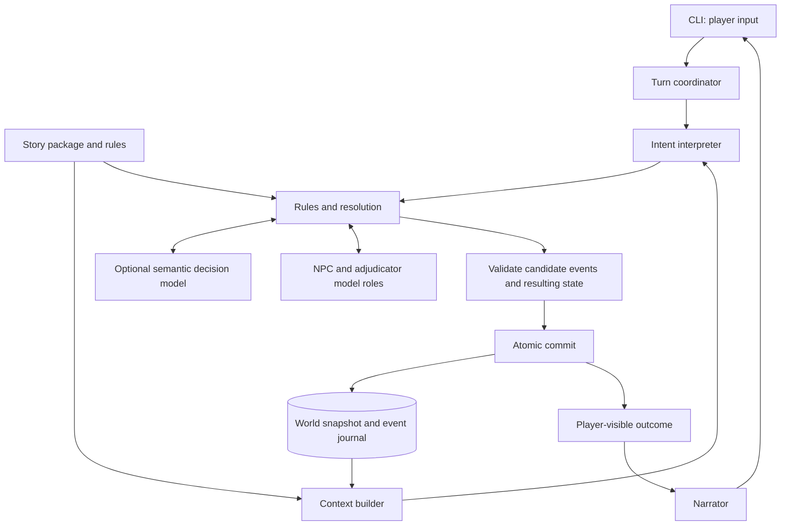

# World representation and turn resolution

Architecture proposal · 4 October 2026 · Initial CLI version

## 1. Recommendation

Build a single local game engine around a **typed, serializable world state**, a **versioned story package**, and an **append-only journal of committed events**. Models interpret language, play characters, and propose rulings. The engine checks those proposals, resolves mechanics, and commits the resulting changes.

The central contract is:

> A model can propose what happens; only the engine can make it part of the world.

This gives the game room for tabletop-style improvisation while keeping inventory, time, character knowledge, and story rules consistent. A saved game must be understandable without reconstructing the world from a chat transcript, and it must be reloadable without asking a model to remember anything.

Start with one process, one active player character, one generative model provider, and SQLite persistence. Use separate model calls for different roles where their access to information differs. Add a decision model such as Jev behind an optional adapter once there are examples against which to evaluate it. Multiple roles do not require multiple model providers or autonomous agents.

This proposal assumes a small authored adventure with room for new details, free-form player input, and explicit turns. Cooperative multiplayer, tactical maps, unrestricted world generation, and continuous background simulation can follow later. The initial design should support conversation, exploration, social checks, item use, and persistent consequences.

## 2. Components and authority



| Component | Responsibility | Authority |
| --- | --- | --- |
| CLI | Read input; display narration, clarification, and commands | No direct world mutations |
| Turn coordinator | Order phases, enforce budgets, track pending requests and retries | Owns turn lifecycle |
| Context builder | Select relevant facts and construct a view for a particular role | Controls information disclosure |
| Intent interpreter | Translate language into attempted actions and speech | Proposes intent; cannot declare success |
| Rules engine | Check prerequisites, apply story policies, calculate outcomes | Owns mechanics and legal transitions |
| NPC performer | Choose a character's response from its perspective | Proposes that NPC's actions and utterances |
| Adjudicator | Interpret unusual actions and propose bounded consequences | Acts within story-defined permissions |
| Decision adapter | Answer narrow semantic questions | Supplies evidence for a ruling |
| Validator and reducer | Check events; apply accepted events to state | Sole mutation path |
| Narrator | Describe the committed, observable result | Cannot add mechanical consequences or secrets |
| Repository | Store and recover state, events, and turn records | Owns durability and idempotency |

The core transition is:

```text
intent = interpret(player_input, player_context)
batch = resolve(state, intent, rules, recorded_decisions, recorded_randomness)
next_state = apply_batch(state, batch)
validate(state, batch, next_state)
commit(batch, next_state)
output = narrate(project_for_player(batch.events, next_state))
```

`apply_batch` applies ordered events through a pure `apply_event` function and advances the counters recorded in the batch envelope. Neither function performs model calls, network requests, clock reads, or random draws. Replaying recorded batches reproduces the same state. Re-running a model with the same prompt is not assumed to reproduce the same decision.

## 3. Representing the world

### 3.1 Separate definitions, runtime state, and derived views

| Layer | Contents | Lifetime |
| --- | --- | --- |
| Story package | Setting, starting entities, character profiles, rules, quest definitions, permitted improvisation, prose | Immutable and versioned during a campaign |
| Runtime state | Current entities, relationships, facts, beliefs, conversations, quest progress, time, pending events | Changes through committed events |
| Derived views | Inventory lists, visible exits, prompt contexts, summaries, search indexes | Rebuildable; never an independent source of truth |

A story package should have an ID, version, content hash, compatible engine/schema versions, and a ruleset reference. Store or bundle the exact package with the save so editing the author's source files does not silently change an existing campaign. A deliberate rule or story upgrade requires a migration.

Natural-language setting descriptions belong in the package. Rules that must always hold also need machine-checkable representations. “Magic cannot bring back the dead” should compile to a resurrection constraint, not exist only as a sentence in a prompt.

### 3.2 Entities and components

Use an entity map keyed by stable IDs. Characters, locations, objects, factions, and portals are entities. Components describe capabilities and state, allowing a new creature or interactive object to reuse existing mechanics without requiring a deep class hierarchy.

Suggested initial components:

| Component | Example fields | Purpose |
| --- | --- | --- |
| `identity` | name, aliases, short description | Entity resolution and presentation |
| `placement` | `container_id` | Physical location or possession |
| `location` | environment tags | Rooms, wilderness areas, and nested places |
| `portal` | endpoint IDs, open/closed, lock state | Traversal between locations |
| `actor` | profile reference, active goals, disposition | Characters able to act |
| `stats` | skills, health, resources | Mechanics, as required by the story |
| `item` | tags, quantity, affordances | Carryable and usable objects |
| `conditions` | condition IDs, source, expiration | Temporary effects |

The resulting world is a graph, but JSON maps and indexed lookups are sufficient for the first version. A graph database is unnecessary at this scale.

Use one representation for each fact. An item inside a character has `placement.container_id = character_id`; that character's inventory is derived from placement. Ownership is a separate relation if theft or borrowing matters. A stolen ring can be physically held by the player while still belonging to someone else.

Physical containment must be acyclic, and each physical entity has at most one immediate container. A character's current room is found by following containment. Locations can nest inside regions. Portals connect places; they do not duplicate the characters located there.

Use typed, directed relationships for facts that do not fit components: allegiance, ownership, kinship, trust, fear, obligation. A guard's trust in the player is independent of the player's trust in the guard. Declare bounds and update policies for numeric relationships. Do not maintain a second copy of a relationship in each character.

### 3.3 Truth, knowledge, belief, and speech

Conversation needs several distinct concepts:

| Concept | Example | Representation |
| --- | --- | --- |
| World truth | The court is not expecting the player | Component value or canonical proposition |
| Observation | The guard saw a royal seal | Perception/observation event with observer and source |
| Belief | The guard thinks the court expects the player | Character belief about a proposition |
| Utterance | The player says “The court expects me” | Speech event, audience, and optional claim references |
| Unspecified detail | Whether an unnamed merchant has a sister | Unknown until authored or validly established |

Keep exact mechanical facts in components. Use a small proposition registry for story facts such as “the duke arranged the ambush,” with typed predicates, entity references, truth value, provenance, and discovery policy. Do not duplicate health or location in this registry.

Truth is `true`, `false`, or `unknown`. Missing lore means unknown, not false. Mechanical predicates use explicit schema defaults; a known empty inventory is different from an omitted inventory in a partial prompt. When the truth of a proposition is computable from a component, query that component.

A belief has a holder, proposition, stance (`believes`, `disbelieves`, or `uncertain`), source events, and acquisition time. A false belief is valid state. Character conviction and a model's confidence in classifying a sentence are separate fields with different meanings.

An utterance never changes world truth merely by asserting it. It may cause a listener to acquire or revise a belief under the applicable perception and social rules. Characters can lie, misremember, conceal information, or change their minds.

Keep the human player's transcript separate from the player character's knowledge. The player may infer a secret; the character should only gain an explicit knowledge entry through an in-world observation or discovery. Player input cannot promote a guess to canonical truth.

### 3.4 Conversation and story progress

Each active conversation records participants, location, topic, recent utterance IDs, unresolved questions, and pending offers or commitments. An offer is structured state: proposer, recipient, conditions, expiry, and status. This lets “I accept” refer to the correct bargain after a save and reload.

Make commitments explicit events. An NPC's generated “I'll give you the key” must correspond to a validated promise or transfer proposal before it can be displayed. Dialogue about existing facts can reference them; dialogue revealing a secret needs an authorized disclosure; a deliberate lie needs a claim record. Stylistic wording can vary without changing these meanings.

Quests use authored state machines, with allowed transitions and completion predicates. For example, returning an item can satisfy a quest; the narrator describing the hero's triumph cannot. Store objectives, progress, deadlines, and consequences independently of summaries.

### 3.5 Time and pending activity

Track both a turn index and integer world ticks. A turn is a player decision cycle; ticks measure elapsed fictional time. Their relationship belongs to the ruleset. Looking at an already visible inventory may cost no time, a conversation exchange one tick, and a journey many ticks.

Store scheduled effects with an ID, due tick, handler ID, arguments, cancellation condition, and stable ordering key. Resolve due effects deterministically. Events such as a poison tick or a caravan's arrival can change an offscreen area without simulating every resident on every turn.

For long actions, advance to the next due event, resolve it, and recheck whether the action can continue. Do not jump past an interruption that could invalidate the remaining action. The initial adventure can use only short actions and a small set of scheduled handlers.

### 3.6 Illustrative state

This excerpt shows the relevant world records before a conversation at a gate. A complete save also contains the story package, RNG state, event position, relationship and quest maps, scheduled effects, and durable turn records described below. The profile and policy references resolve inside the example story package.

```json
{
  "schema_version": 1,
  "campaign_id": "campaign:gate-demo",
  "world_version": 12,
  "story_ref": {"id": "gate-at-dusk", "version": "1"},
  "ruleset_ref": {"id": "conversation-d20", "version": "1"},
  "clock": {"turn": 12, "tick": 720},
  "entities": {
    "location:gatehouse": {
      "identity": {"name": "Gatehouse"},
      "location": {}
    },
    "location:courtyard": {
      "identity": {"name": "Courtyard"},
      "location": {}
    },
    "portal:gate": {
      "identity": {"name": "Iron gate"},
      "portal": {
        "endpoints": ["location:gatehouse", "location:courtyard"],
        "state": "closed",
        "locked": false
      }
    },
    "actor:player": {
      "identity": {"name": "Lea"},
      "placement": {"container_id": "location:gatehouse"},
      "actor": {"profile_ref": "profile:lea"},
      "stats": {"persuasion": 2}
    },
    "actor:oren": {
      "identity": {"name": "Oren"},
      "placement": {"container_id": "location:gatehouse"},
      "actor": {
        "profile_ref": "profile:oren",
        "goals": ["protect_the_court"],
        "disposition": "wary"
      }
    },
    "item:royal-seal": {
      "identity": {"name": "Royal seal"},
      "placement": {"container_id": "actor:player"},
      "item": {"tags": ["credential"], "quantity": 1}
    }
  },
  "propositions": {
    "fact:expected-at-court": {
      "predicate": "expected_at",
      "arguments": ["actor:player", "location:courtyard"],
      "truth": "false",
      "provenance": {"kind": "authored", "story_version": "1"},
      "discovery_policy_ref": "discovery:court-invitation"
    }
  },
  "beliefs": {
    "actor:player": [
      {
        "proposition_id": "fact:expected-at-court",
        "stance": "disbelieves",
        "source": {"kind": "initial_knowledge", "story_version": "1"},
        "acquired_tick": 0
      }
    ],
    "actor:oren": []
  },
  "conversations": {
    "conversation:gate": {
      "participants": ["actor:player", "actor:oren"],
      "location_id": "location:gatehouse",
      "topic": "entry",
      "recent_utterance_ids": [],
      "pending_offer_ids": []
    }
  }
}
```

IDs are stable identifiers, never names inferred afresh each turn. The engine allocates IDs and maintains aliases for language resolution. Renaming Oren must not break his relationships, memories, or quest references.

## 4. Story rules and controlled improvisation

### 4.1 Three kinds of rules

1. **Engine invariants:** references resolve, quantities stay within bounds, containment is valid, events have authorized causes, and a transaction is internally consistent.
2. **Story mechanics and policies:** action costs, checks, magic constraints, NPC boundaries, quest transitions, and permitted consequences. Implement these as registered handlers with validated declarative parameters.
3. **Narrative guidance:** tone, character voice, themes, and preferences. Supply this to the relevant model, but do not use it as the only enforcement for a mechanical restriction.

Use an explicit precedence order: engine invariants, explicit story overrides permitted by the ruleset, general ruleset defaults, then narrative guidance. Reject contradictory hard rules when loading the story. Soft preferences cannot override a hard constraint.

For the first version, write a small registry of actions and predicates in ordinary code. Story authors compose those handlers through data. Avoid building a general programming language or executing code produced by a model.

An action definition should name its argument schema, prerequisites, time/resource costs, semantic questions, check policy, permitted outcomes, and effect handler. NPC policies can constrain allowed outcomes while still letting a model choose a motive and voice.

For example, the gate story can define:

```yaml
id: gate.request_entry.v1
handler: social_check_then_npc_response
requires:
  - actor_and_guard_can_converse
  - presented_credential_is_in_actor_possession
  - guard_can_operate_gate
semantic_input: credential_appears_relevant_to_guard
check:
  skill: persuasion
  die: d20
  difficulty: 12
  on_success: guard_admits_and_believes_claim
  on_failure: guard_refuses
cost_ticks: 1
effects_policy: gate_entry_effects.v1
```

This is a proposed story format, not a third-party API. The named handlers and policies must be implemented and validated. In this particular adventure the success policy commits Oren to admitting a convincing apparent courier; another story could have him refuse regardless of persuasion because of an overriding obligation. Social skills do not grant unrestricted control over an NPC.

### 4.2 Unusual actions

A finite verb list should not make free-form play feel like a menu. Add a `custom_attempt` path:

1. Interpret the goal, method, targets, and relevant objects.
2. Check whether existing affordances and actions cover it.
3. If needed, let an adjudicator propose a ruling using an authored difficulty rubric and permitted effect templates.
4. Validate the proposed ruling, establish its stakes, and then resolve it normally.

For example, “I wedge my dagger under the door” can combine an item affordance with a temporary `jammed` condition. It does not require letting the model invent an arbitrary field or a new executable rule. Store a reusable ruling when the story permits it, so an equivalent attempt later receives consistent treatment.

The story's improvisation policy should distinguish cosmetic description, new persistent entities, and changes to established facts. A model may describe rain already established by the scene; inventing a usable rope requires a permitted creation event. Revealing a previously unspecified shopkeeper's name can be allowed; changing the identity of an already established murderer cannot.

New entity proposals use existing templates, allowed locations, and bounded resources. Once committed, generated details become ordinary canonical state with provenance. Repeated references reuse those records. Important new details must be committed before they appear in narration.

Some semantic contradictions will escape automated checks. Minimize that risk through bounded improvisation and small relevant contexts; do not claim that a second model can prove an arbitrary story extension consistent.

## 5. The mutation protocol

### 5.1 Intent, proposal, and event are different records

**Intent:** what the actor attempts. **Proposal:** a suggested ruling or response. **Event:** an accepted occurrence that has already been resolved.

For the input “I show Oren the seal and say, ‘The court expects me. Let me in,’” the interpreter might produce:

```json
{
  "kind": "social_attempt",
  "target_id": "actor:oren",
  "goal": "gain_entry",
  "presented_item_ids": ["item:royal-seal"],
  "utterance": "The court expects me. Let me in.",
  "claims": [
    {"proposition_id": "fact:expected-at-court", "asserted_truth": true}
  ]
}
```

The coordinator wraps this payload with the campaign ID, actor ID, input ID, and base world version. Those authority fields come from the session, not the model. A proposed target must exist and be addressable from the actor's context, or be an explicitly unresolved reference requiring clarification.

A proposal names the applicable rule, evidence references, requested semantic judgments, and allowed effect templates. It cannot directly edit JSON paths, fabricate a die result, or set the world's version counter.

An engine-produced event might look like:

```json
{
  "event_id": "event:gate-demo:13:6",
  "event_schema_version": 1,
  "turn_id": "turn:13",
  "sequence": 6,
  "base_world_version": 12,
  "type": "PortalStateChanged",
  "actor_id": "actor:oren",
  "payload": {
    "portal_id": "portal:gate",
    "from": "closed",
    "to": "open"
  },
  "cause_event_ids": ["event:gate-demo:13:4"],
  "rule_id": "gate.request_entry.v1",
  "observed_by": ["actor:player", "actor:oren"]
}
```

The engine stamps IDs, ordering, visibility, and provenance. A batch envelope records its input ID, base and resulting world versions, and completed turn index, so replay also restores those counters. `observed_by` records this occurrence's observers; the event archive remains private, and other characters may discover the resulting open gate later. A model cannot make hidden information public by setting a visibility field.

Begin with a small typed event vocabulary: `UtteranceMade`, `ItemPresented`, `CheckResolved`, `BeliefChanged`, `EntityMoved`, `ItemTransferred`, `PortalStateChanged`, `ConditionApplied`, `OfferMade`, `OfferAccepted`, `QuestAdvanced`, `EntityCreated`, and `TimeAdvanced`. Add domain events when actual story needs justify them. Avoid a universal unrestricted `SetField` event in the model-facing contract.

### 5.2 Validation

Validate model outputs against closed schemas with required fields, enums, numeric bounds, and explicit extension points. JSON Schema can reject unknown object properties, but this does not validate game semantics; reference, authorization, and world consistency checks still belong in the engine. See the [JSON Schema object reference](https://json-schema.org/understanding-json-schema/reference/object).

Validate in this order:

1. **Shape:** correct schema and supported versions; no unknown event types.
2. **References and authority:** valid entities, active actor, permitted targets and effects, legitimate rule and evidence references.
3. **Prerequisites and mechanics:** reachability, possession, costs, locks, conditions, check outcomes, and NPC constraints.
4. **Sequential consistency:** apply events to a temporary state in order; validate each event against the effects of earlier events.
5. **Final invariants:** no duplicate items, illegal quest states, impossible containment, unauthorized disclosures, or contradictory hard facts.
6. **Commit guard:** the persisted world version still matches the turn's base version and the input has not already committed.

Validate both the proposed effects and the final state: a plausible final inventory does not justify an unauthorized transfer. Keep causal links from each consequential effect to the action, rule, check, or scheduled trigger that permits it.

One repair attempt can return precise errors to the proposing model. If it still fails, use a defined ruleset fallback or leave the input unresolved. A malformed proposal is an engine/model failure and must not consume a turn. A valid in-world failure, such as an unsuccessful lockpick attempt, does consume the costs specified by its rule.

## 6. Turn lifecycle

Use explicit phases: `awaiting_input → interpreting → resolving → ready_to_commit → committed → presenting`. Clarification returns to input collection without advancing world time. Persist operational turn status separately from canonical world state.

1. **Receive and identify input.** Allocate a stable input/turn ID. Handle read-only commands such as `/inventory`, `/look`, `/journal`, and `/save` without a model when possible. Active searching is an action and can have a cost.
2. **Build the player's context and interpret.** Resolve aliases and recent references. Treat a compound sentence as an ordered plan, but resolve only the next consequential action unless the rules define a single composite action. Do not spend resources on ambiguous intent; ask an in-game clarification first.
3. **Check legality and establish stakes.** Use authoritative state to check prerequisites. Determine difficulty, costs, possible outcomes, and required judgments before rolling. Clarify if interpretation would commit the player to a materially different action. Display observable risks without leaking hidden modifiers or facts.
4. **Resolve the player action on a working copy.** Obtain semantic judgments as needed, perform engine-owned random draws, and stage events. Retrying a model call must reuse an existing roll rather than reroll until success.
5. **Resolve immediate NPC responses.** Build each NPC's view from the staged world and its own knowledge. Apply validated responses sequentially in a stable ruleset order. An NPC cannot see a later response that has not happened yet.
6. **Advance time and resolve due effects.** Charge the action's configured duration, process interruptions and triggers, and update quests and conditions. Immediate conversation reactions are included in the exchange's cost; separate NPC actions follow their own scheduling rules.
7. **Validate and commit the entire event batch.** Update the world version once for the batch. Commit events, resulting snapshot, RNG continuation, and a minimal player-visible outcome together.
8. **Present the result.** Generate narration from committed observable events and approved utterances. Store the delivered text for continuity and redisplay after reload. If narration fails, display the saved factual outcome. Never roll back an already committed turn because of prose generation failure.

Keep approved NPC utterances intact during presentation. Give the narrator explicit outcome references and restrict its additions to style and harmless sensory detail. Check entity references and any structured claims it returns against the outcome; fall back to factual templates when those checks fail. Arbitrary prose consistency cannot be fully checked in code, so unsupported narration remains a model-evaluation concern. Later turns retrieve world facts from state, never by treating that prose as new canon.

Order is part of the ruleset. The initial version uses player action, immediate reactions, then elapsed-time effects. Combat can later supply initiative and interrupt rules through the same coordinator and event path.

Use explicit limits on model calls, active NPC responses, and trigger processing. Avoid recursive conversations where NPCs talk indefinitely without returning control to the player. If an atomic resolution exceeds its processing limit, abort it for diagnosis rather than silently omitting consequences.

## 7. Model roles, context, and Jev

### 7.1 Context is a projection, not the whole save

Construct model input explicitly for each role:

| Role | Relevant input |
| --- | --- |
| Intent interpreter | Player text, perceived scene, known entity aliases, recent conversation, action schemas |
| NPC performer | Own profile/goals/beliefs, current perceptions, heard speech, applicable behavior policies |
| Adjudicator | Relevant authoritative facts, candidate intent, applicable rules, allowed effects |
| Narrator | Committed player-visible outcomes, approved dialogue, presentation style, public scene details |
| Scene describer | Current surroundings, nearby people and visible objects, open/closed portals; no inventory, hidden lock state, knowledge, or remote scene details |
| Decision model | Minimal facts or beliefs needed for one specific judgment |

The NPC projection exposes a belief's content and stance, never the hidden canonical truth alongside it. A belief that the court expects Lea must look credible to Oren even when the engine knows it is false. The adjudicator may need that truth for a deception mechanic; the NPC performer does not.

Filter access before retrieval. Do not search the whole world and trust a prompt instruction to suppress leaked secrets. Build contexts using direct entity references, scene membership, active quests, current conversation, and relevant event IDs. Include provenance and the world version so stale or unsupported claims can be identified.

All model sessions should be reconstructible from saved data. Separate NPC calls must not inherit another character's private conversation history, including when the same provider/model serves every role.

Summaries are lossy indexes into history. They may help retrieve source events but cannot establish facts, complete quests, or overwrite a belief. Start with recent utterances plus structured records; add summary generation only when context size requires it. Reserve prompt space for mandatory rules and facts before optional history. If required context will not fit, narrow the task rather than dropping constraints.

Player input, dialogue, and in-world documents are game data, even when they contain commands such as “ignore the rules.” Models receive no persistence credentials or unrestricted mutation tools. Engine checks remain authoritative when a model follows an inappropriate instruction.

### 7.2 Optional decision-model adapter

Jev's documented interface evaluates a supplied state using typed questions: **Choice** selects an option, **Score** evaluates a rubric, and **Noul** returns a probability for a yes/no judgment. This makes it a plausible adapter for bounded semantic decisions in this design. Dialogue and novel proposals still need a generative model. See the [TypeSafe introduction](https://docs.typesafe.ai/introduction).

Candidate uses, to validate with game-specific examples:

| Judgment | Candidate mechanism | Engine use |
| --- | --- | --- |
| Which known person does “the captain” refer to? | Choice over visible candidates plus `ambiguous`/`none` | Resolve a reference or ask for clarification |
| Is this utterance a request, offer, threat, or greeting? | Choice with explicit criteria | Select a conversation handler |
| How well does this argument address this NPC's stated concern? | Score with discrete descriptive levels | Select a bounded modifier through a rule table |
| Does this statement appear to promise repayment? | Noul | Propose a commitment interpretation; clarify uncertain cases |

Do not ask Jev whether a player owns an item, whether a quest flag is set, how much gold remains, or whether a roll succeeds. These are exact queries and arithmetic. TypeSafe's published Jev 1.13 limitations specifically discuss numerical precision, distracting context, and unsuitable generative tasks; assess the deployed version against the game workload. See [Jev 1.13 limitations](https://docs.typesafe.ai/model-jaggedness/jev-1.13).

Represent an internal decision request independently of provider SDK shapes:

```text
DecisionRequest
  question_id, rubric_version, context_world_version
  perspective_actor_id, evidence_refs
  kind: choice | score | yes_no
  question, options_or_rubric, context

DecisionResult
  value, probabilities_if_available, confidence_if_available
  provider, model_version, request_id
```

These are proposed application contracts. The provider adapter translates them to actual API requests and validates results. Keep a generative-model adapter and a scripted test adapter behind the same interface where their capabilities match.

TypeSafe's `confidence` for Choice and Score summarizes their output distribution; Noul has no separate confidence field. Treat these as model uncertainty signals, not the probability that an in-game action succeeds or a guarantee of correctness. Choose per-question thresholds using labeled game examples, and retain an uncertain/clarify path. See [TypeSafe confidence](https://docs.typesafe.ai/confidence).

Batch only independent questions with the same permitted context. TypeSafe evaluates questions independently against the same supplied state, so a question cannot rely on another answer from that batch. Different NPC perspectives require separate contexts. See [TypeSafe state](https://docs.typesafe.ai/concepts/state).

A decision cache, if introduced, must include the complete relevant context hash, perspective, model/version, question, and rubric version. Similar wording alone is not enough: the guard's beliefs may have changed since the previous request.

### 7.3 Model call budget and fallback

Use code directly for commands and exact rules. An ordinary conversation turn will typically require interpretation, an NPC decision/utterance, and narration; an unusual action can add adjudication. A decision model is optional and should earn its additional latency and cost in evaluation.

For each turn, record model IDs, prompt-template versions, supplied evidence references, structured results, latency, token usage where available, and retries. Log concise ruling justifications, not hidden model reasoning. Configure a total deadline and call budget. On a decision-provider outage, use a tested alternative or a ruleset fallback; never silently turn uncertainty into success. If resolution cannot finish, leave the world unchanged and make the pending input resumable.

## 8. Persistence, replay, and recovery

Use a local SQLite database per campaign. Store a full JSON snapshot after each committed turn initially: small worlds make this simple, and it keeps loading straightforward. Retain the event journal to inspect causes, replay, and debug. Later snapshots can be less frequent without changing the event protocol.

Suggested logical records:

| Record | Key contents |
| --- | --- |
| `campaign` | IDs, current world version, pinned story/rules/reducer versions |
| `story_package` | Exact versioned definitions and content hash |
| `snapshot` | World version, event position, serialized state, RNG state, integrity hash |
| `turn_record` | Input ID/text, base version, phase, staged decisions/rolls, outcome, delivered text |
| `event` | Campaign/turn/sequence, type/version, payload, causes, rule, visibility |
| `model_call` | Role, provider/version, context references/hash, result, timing, usage |

The pinned initial state plus the committed event journal is the replay source of truth. Snapshots are verified checkpoints of that history; transcripts and model logs explain how it was produced. Operational records may change as a turn progresses without advancing world time or the world version.

Make one short database transaction append all final events, insert the snapshot, advance the campaign version, and mark the input committed with its fallback outcome. Perform model calls outside that transaction. Enforce unique input IDs and event sequence keys, and compare the base version before commit. SQLite supports explicit transactions and one writer at a time, which fits this initial process model. See [SQLite transactions](https://www.sqlite.org/lang_transaction.html).

Distinguish these failure cases:

| Failure point | Recovery |
| --- | --- |
| Before commit | Load the previous state; resume or discard staged work for that same input |
| After commit, before output | Redisplay or render the saved committed outcome; do not apply effects twice |
| After output | Reload state and the stored response normally |
| Base version changed | Discard the stale proposal and rebuild its context before resolving |
| Save schema unsupported | Migrate a copy through explicit versioned migrations, or refuse with a useful error |

Use a specified PRNG algorithm with serializable state. Journal each die result and associate draws with stable turn/check IDs. A `CheckResolved` event also records its RNG continuation state, which replay restores without drawing again. Persist staged draws before dependent model work so retries reuse them. A seed alone is insufficient for replay if the number or order of draws changes. Replay applies resolved events, rather than rerunning rules or sampling models.

Pin event reducer semantics as well as schema and ruleset versions. A new reducer that interprets an old event differently can break replay even when the JSON shape still validates. Migration must preserve old saves and be checked against known replay hashes.

Support a portable JSON export containing the story package, current state, required version metadata, RNG continuation, event history, and relevant conversation/turn records. Validate it on import. Do not rely on serializing in-memory objects or provider conversation IDs. Save data includes hidden story information; player-facing `/journal` output is a filtered view of that data.

Optional undo should create a branch from an earlier committed version; it should not erase the journal. Leave branch management out of the first playable version.

## 9. Worked turn: a convincing lie

Starting from the state excerpt in section 3.6:

> Player: I show Oren the seal and say, “The court expects me. Let me in.”

1. The interpreter returns a social attempt targeting Oren, with the seal as presented evidence and an asserted claim. It does not set the claim's canonical truth to `true`.
2. The engine confirms co-location, possession of the seal, and Oren's ability to operate the gate. It selects `gate.request_entry.v1`. The story's perception policy lets him examine the presented seal.
3. If needed, a semantic model judges whether this credential appears relevant from Oren's available evidence. It sees his perspective, not the hidden fact that Lea is not expected. The resolved judgment selects the relevant rule branch.
4. The engine fixes the authored difficulty at 12, rolls 14, adds Lea's persuasion bonus of 2, and records success. These numbers are illustrative game mechanics; model confidence is not used as the die roll.
5. Under this adventure's success policy, Oren accepts the apparent courier's claim and opens the gate. His performer supplies a compatible utterance and cannot substitute a different mechanical result.
6. The staged event sequence is:

   | Sequence | Event | Consequence |
   | --- | --- | --- |
   | 1 | `ItemPresented` | Oren observes the seal; Lea retains possession |
   | 2 | `UtteranceMade` | Oren hears Lea's assertion; the underlying fact remains false |
   | 3 | `CheckResolved` | Stores rule, difficulty, modifier, roll, success, and RNG continuation |
   | 4 | `BeliefChanged` | Oren now believes Lea is expected; cites the assertion and successful check |
   | 5 | `UtteranceMade` | Oren's validated response: “They're waiting, then. Go through.” |
   | 6 | `PortalStateChanged` | Gate changes from closed to open; caused by the accepted social outcome |
   | 7 | `TimeAdvanced` | Tick 720 becomes 721; no scheduled effects are due in this example |

7. Validation succeeds. One commit advances world version 12 to 13 and turn 12 to 13. The gate is open, Oren holds a false belief, the invitation fact remains false, and Lea is still in the gatehouse with the seal.
8. The narrator describes Oren inspecting the seal and opening the gate. The engine does not move Lea into the courtyard until the player chooses to enter.

On a failed check, this policy would produce refusal, leave the gate closed, and consume the exchange's one tick. A malformed model response would instead leave the turn uncommitted. These are different kinds of failure.

If the process stops immediately after the successful commit, loading the campaign still shows the open gate and the same belief. The engine can redisplay the outcome without another model judgment or die roll.

## 10. Implementation path

Keep the implementation language open until development starts; the contracts are language-neutral. A small module layout is sufficient:

```text
game/
  domain/          # State, IDs, commands, events, schemas
  rules/           # Action handlers, predicates, validation, reducers
  turns/           # Coordinator, sequencing, pending-turn recovery
  context/         # Perspective projections and relevant-history retrieval
  models/          # Generative and decision-provider adapters
  persistence/     # SQLite repository, export/import, migrations
  cli/             # Input and presentation
stories/
  gate-at-dusk/    # Definitions, initial state, profiles, rules, examples
```

Build in small playable steps:

| Step | Deliverable | Completion criterion |
| --- | --- | --- |
| 1. World kernel | Schemas, entity queries, events/reducers, persistence, fixed fixture story | Save/load and event replay produce equal state without any model calls |
| 2. Conversation slice | One generative provider; player interpretation; one NPC; narration | The gate scene supports success, refusal, clarification, and reload |
| 3. Persistent consequences | Beliefs, offers, item transfer, a quest, one scheduled effect | A promise and a discovered secret still matter several turns later |
| 4. Bounded improvisation | Custom attempts, template-based conditions and entity creation | A novel action can have consequences without violating hard rules |
| 5. Decision routing | Optional Jev adapter and evaluation corpus | Measured judgment quality and turn latency justify enabling particular routes |

Do not make vector search, a graph database, distributed workers, or a multi-model ensemble prerequisites for the first playable loop. Direct lookups, recent events, typed records, and a single local writer cover its requirements.

## 11. Validation and unresolved design choices

The architecture should be judged on continuity and playability as well as schema validity. Initial acceptance scenarios should include:

- A lie changes a listener's belief without changing the underlying fact.
- A guard cannot mention a secret absent from its knowledge and perceptions.
- A retry cannot duplicate an item transfer or reroll a completed check.
- A failed in-world attempt consumes its defined cost; failed parsing does not.
- A promise, pending offer, and quest state survive saving and loading.
- Event replay and snapshot loading yield the same normalized state and RNG continuation.
- “I give him the key” triggers clarification when two plausible recipients are present.
- A scheduled interruption is resolved before the remainder of a long action.
- Narration failure still leaves a readable, accurate committed outcome.
- A player instruction embedded in dialogue cannot bypass action authority or story constraints.
- A generated persistent object is created once and can be referred to on later turns.

Use unit/property tests for deterministic mechanics and invariants, integration tests with scripted model responses for the turn pipeline, and a small labeled corpus for semantic decisions. Evaluate real model outputs for intent accuracy, character knowledge leaks, unsupported narration, consistency of rulings, clarification frequency, and response latency. Schema validation alone cannot establish good roleplay.

The first playable story should settle three product choices through playtesting: how often social interactions need dice, how much new canon the model may introduce, and how much mechanical detail the CLI should display. The proposed defaults are checks only when uncertainty has consequences, conservative creation of persistent details, and concise narration with an optional mechanics/debug view. These choices can change through story and presentation policies without replacing the world model.
